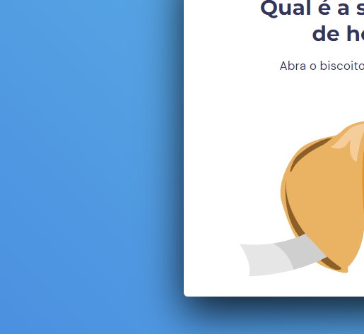

<h1 align="center"> Biscoito Da Sorte🍀 </h1>

O biscoito da sorte foi uma aplicação proposta pela RocketSeat no programa de formação WEB EXPLORER e desenvolvida por mim, Juliano Mariano.  

  <a href="#-tecnologias">Tecnologias</a>&nbsp;&nbsp;&nbsp;|&nbsp;&nbsp;&nbsp;
  <a href="#-projeto">Projeto</a>&nbsp;&nbsp;&nbsp;|&nbsp;&nbsp;&nbsp;
  <a href="#-layout">Layout</a>&nbsp;&nbsp;&nbsp;|&nbsp;&nbsp;&nbsp;
  <a href="#memo-contato">Contato</a>

 

  

## 🚀 Tecnologias

Esse projeto foi desenvolvido com as seguintes tecnologias:

- HTML e CSS
- JavaScript
- Git e Github
- Figma

## 💻 Projeto

O bicoistinho da sorte foi desenvolvido para deixar o seu dia mais leve, animado e otimista.
Descanse o mouse em cima do biscoitinho por alguns segundos e depois clique nele e terá uma mensagem que com toda certeza, vai melhorar o seu dia!!!🍀

- [Visite o projeto online](https://julianomariano.github.io/lucky-cookie/)

## 🔖 Layout

Você pode visualizar o layout do projeto através [DESSE LINK](https://www.figma.com/community/file/1182751789348533739). É necessário ter conta no [Figma](https://figma.com) para acessá-lo.

## 🌐 Contato

LinkedIn: https://www.linkedin.com/in/juliano-marianodev/